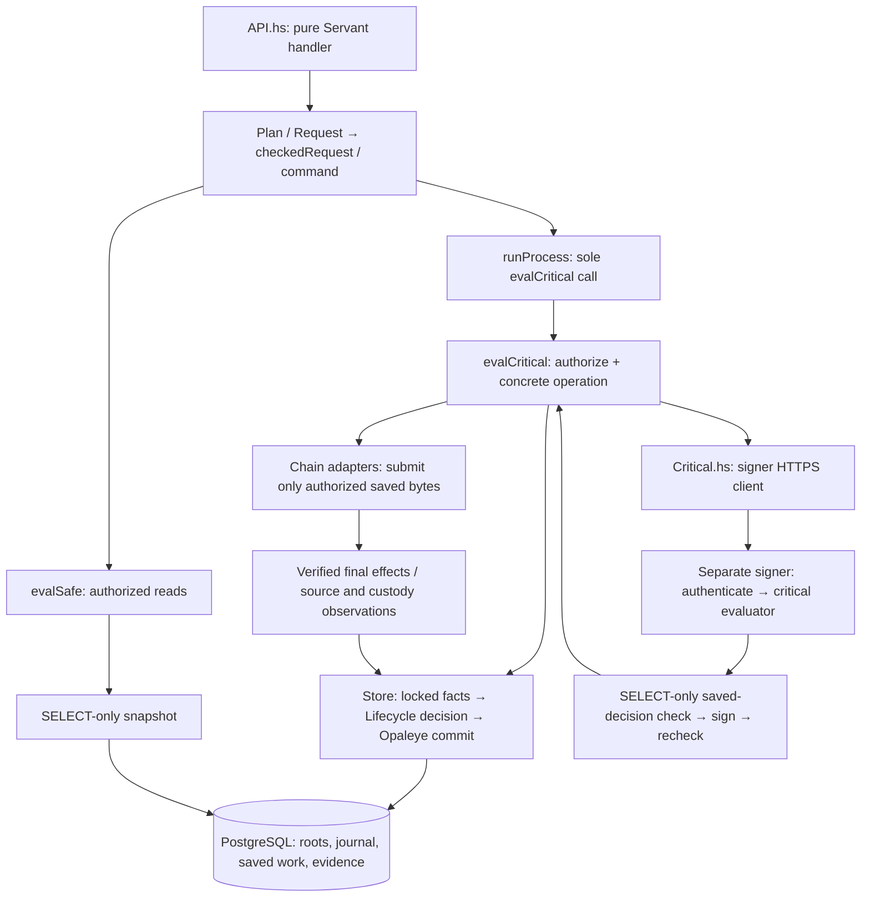

# Architecture and financial contracts

The source map is in the [audit path](#audit-path) below. This guide defines the
boundaries a reviewer must trace; [release review](RELEASE-REVIEW.md) records what
is actually verified. There is one Servant HTTP/worker process and one dedicated
signer. PostgreSQL, the native daemon, Solana RPC and restic are dependencies.
The Haskell browser is compiled by GHC JavaScript; Rust is confined to SDK FFI.
Public HTTPS terminates directly in the worker's WarpTLS listener; no reverse-proxy
process is required. Optional certificate/key environment variables enable public
IPv4 TLS; their absence preserves loopback HTTP, and partial configuration refuses
startup. Constant-space global request/order admission budgets precede the existing
body/concurrency controls in TLS mode. These controls grant no DSL authority and
are not a separate process isolation boundary. The signer remains separate.

## Start the audit here

Follow one order through this path, then repeat it for refund and earned funding.
The [source map](#audit-path), authoritative-fact table and invariant
index below identify the concrete implementation and its checks. Historical test
results belong in RELEASE-REVIEW; they are not assumptions that new code is safe.



No database transaction spans signing, chain RPC or backup upload. A pure decision
does not carry execution authority; the closed Store leaf obtains its facts under
the database lock. The signer has no database writer and cannot broadcast. Saved
bytes must be durably recorded and covered before the worker can submit them.

## Requests, dictionaries and evaluators

The user's exact [Main.hs](reference/Main.hs) is preserved outside production
builds, SHA-256 `f1d0777a8d2fddd62881aa5d85f518884c9d4efb451480f1520a677ab2319ea2`.
Read it before changing the operation boundary. The production grammar corrects
its permissive/incomplete sketch types while retaining its constrained design:

```haskell
data family Evaluation (severity :: Severity)

class Typeable (OperationContext caller severity op)
    => Operation caller severity op | caller -> op, op -> caller where
  type OperationContext caller severity op = (context :: Constraint)
    | context -> caller severity op
  command :: op severity a -> DSL caller severity a
  interpretOperation :: DSL caller severity a -> Either Text (DSL caller severity a)
  authorizeOperation :: Evaluation severity -> op severity a -> IO ()
  evaluateOperation :: Evaluation severity -> op severity a -> IO a

data Request caller severity a where
  Request :: Operation caller severity op
          => op severity a -> Request caller severity a

checkedRequest :: forall caller severity a.
  Request caller severity a -> Either Text (DSL caller severity a)
checkedRequest (Request (op :: requested severity a)) =
  interpretOperation @caller @severity @requested (command op)
```

Four closed caller families and six ground instances cover customer/operator
safe and critical work, and worker/signer critical work. Functional dependencies
fix each caller's family; severity-indexed GADTs fix its executable instructions.
The associated `OperationContext` family returns an injective constraint type;
each instance defines it as its fully specified `Operation` constraint.
DSL constructors retain only that fully specified associated constraint. The private
matching-only `Instruction` view lives beside the ground instances in `Critical.hs`,
where their type equations reduce it to the exact `Operation` dictionary. It recovers
that dictionary from the closed grammar without admitting arbitrary instructions.

`checkedRequest` constructs the DSL from the original existential request and
selects that request's `interpretOperation` instance explicitly. That pure method
uses `eqT` and `Refl` to establish equality of the request and DSL's **constraint
types**. There is no `operationDictionary` method or explicit dictionary argument.
This check does not compare dictionary values, leaf constructors or payloads.
Coherent ground instance heads, construction from the original request and the
typed leaf results remain essential; reflection does not replace authorization.

`Plan caller a` contains a safe or critical existential request. Customer handlers
have `ServerT CustomerAPI (Plan 'Customer)` and contain no effects. Servant's hoist
checks and evaluates the request; only its concrete result is serialized.
Order creation being critical does not confer operator or signer authority.
Cabal's customer-api component hides `Operation.Internal` and has no runtime,
store or chain dependency. Pure HTTP/control assembly carries concrete instance
constraints; startup supplies the implementations. Review exports and component
dependencies as well as types.

All six `Operation` instances live in `Critical.hs`, beside the safe and critical
evaluators. Their methods implement concrete effects except local signer execution,
which belongs directly to the gated critical evaluator. There is no
`Interpreter` class, callback bundle or arbitrary environment/program execution
instance. The core declares an opaque `Evaluation` data family; only `Critical.hs`
defines its two concrete severity instances and can construct them. Safe resources
are a reader and public configuration. Critical resources are either worker
resources or signer resources, which contain no writer. IO is fixed; polymorphism
in the result preserves the result selected by the operation's GADT.

Both evaluators recover `Instruction` and call `authorizeOperation`. Safe evaluation
then calls `evaluateOperation`. Critical evaluation matches the four `SigningDSL`
leaves in a signer context, keeping each read/sign/recheck or checkpoint sequence
inside its held gate; all other cases call `evaluateOperation`. The signer instance's
method constructs only the worker's HTTPS client and refuses local signer execution.
There is no signer `run` helper or method that executes keys outside `evalCritical`.
`runProcess`
owns the concrete worker or signer service lifetime. After validating that mode's
resources it allocates one gate and defines the sole `evalCritical` call site.
It then runs HTTP/worker/control or signer HTTPS with that local dispatch. It does
not return an evaluator or hand one to a caller-supplied continuation. The CLI
normalizes both startup modes before its single `runProcess` call; its resource
bracket passes only resource data, never evaluators. Each process retains its own
gate and resource context. Worker entry refuses
signer requests; signer entry refuses customer/operator/worker requests. Internal
worker and signer instructions pass `checkedRequest` and invoke the concrete method
inside the already-held gate, without reacquiring it. Only that internal signer
method constructs the HTTPS client; the signer context executes local signing.

`Signer.hs` owns Servant routes, authentication and TLS transport. Signer startup
and key operations live in `Critical.hs`. The dedicated signer independently
authenticates requests and holds its gate across validation, signing and the
second durable-decision read. Sharing evaluator code does not merge processes,
credentials or gates. Safe reads remain concurrent. No database transaction spans
RPC, signing or remote backup. The workflow instances are intentionally orphan
instances: final-program coherence checks must import `Bridge.Critical`, rather
than testing the grammar component alone.

Do not add arbitrary IO/SQL operations, severity casts, incoherent authorization
instances or generic connection callbacks. The reference's weekly limit/multisig
comments are design notes, not implemented guarantees.

## Signer authority and output identity

Only the critical interpreter constructs the generated Servant `ClientM`. The
private API binds loopback HTTPS and authenticates with a protected token. The
worker trusts the configured certificate with hostname validation; transport has
bounded bodies/timeouts and no proxy, redirects or automatic retries. The signer
uses SELECT-only ledger access, validates saved authorization and exact effects
before/after signing, and never broadcasts.

| POST path | Leaf operation | Unique result constructor |
| --- | --- | --- |
| `/sign-preparation` | `SignPrepared` | `PreparedResult` |
| `/sign-replacement` | `SignReplacement` | `ReplacementResult` |
| `/draft-replacement` | `DraftReplacement` | `DraftResult` |
| `/checkpoint-custody` | `CheckpointCustody` | `CheckpointResult` |

`data family Result severity op` is injective in both indices. Leaf GADTs fix the
result before the command family is hidden existentially. Four disjoint JSON fields
and strict decoders preserve response identity. Retries may repeat the same saved
result; uniqueness means non-interchangeable constructor paths, not fresh values.

[test/formal/SignerPaths.tla](../test/formal/SignerPaths.tla) defines an explicit
`OutputStates` set and checks unique generating paths, route/output alignment,
authentication/refusal and critical-dispatch requirements. The two-request TLC
model reached 54,289 distinct states without violations; deliberate wrong-output,
reused-constructor, auth/dispatch-bypass and observer-dispatch mutations were rejected.
It includes an inductive argument, not a TLAPS-checked unbounded theorem or automatic
Haskell refinement proof. It does not prove cryptography, custody or OS isolation.
Ordinary constructors/JSON remain constructible by trusted code. A separate client
with valid signer credentials can call HTTPS; it is still subject to signer checks.

Custody keys and full native credentials must be inaccessible to the worker through
OS permissions and node RPC restrictions. Deny signing, key export, wallet unlock
and wallet lock; `walletprocesspsbt` is signing-capable even when a caller requests
an unsigned result. Replacement drafting therefore belongs at the signer. Process
separation alone is insufficient while a full credential remains readable.

Optional `nativeUnlockFile` contains 1–1024 exact UTF-8 bytes, no NUL or line ending,
in a protected mode-0600 regular file. Unlock/sign/relock occurs inside the signer
gate; cleanup also follows an uncertain unlock reply. A 120-second daemon lease
bounds exposure after process loss or failed relocking. The worker can allocate
cached descriptor addresses while locked; keypool exhaustion remains a node refusal.

## Database and financial authority

Every application row read/write, diagnostic, privilege check and test fixture
uses Opaleye in a specific closed operation. Connections, transaction control and
reviewed migration DDL are infrastructure. No handler gets a connection or generic
query evaluator. Safe evaluation and the signer use distinct SELECT-only roles,
including SELECT on sequences without USAGE/UPDATE. Startup checks inherited and
catalog privileges, schema creation and elevated role flags.

The writer owns a deployment advisory lock and an independent monotonic host fence.
Ledger actions explicitly use READ COMMITTED / READ WRITE and lock the deployment
row before reading decision facts; safe/signing reads use READ ONLY / REPEATABLE
READ snapshots. The fence advances before commit;
stale/wrong-identity/retired state is refused. Unexpected database failures fence the
connection; policy failures permit reuse only after successful rollback. Startup
pauses intake. Runtime reads/writes accept only schema 22. Schema-18 migration retains
exact history through 006–008 to schema 21; the closed offline converter then builds
payment roots. Fresh initialization expects 001–008, refuses residual financial
rows and atomically installs 009 as the database owner. Worker privileges stay DML
only. Legacy archive restoration performs conversion only in its new private database.

Amounts are canonical base-unit decimal strings. Both conversion assets have eight
decimals; arithmetic uses Integer with bounded persisted values. New fee is
`ceiling(gross * 100 / 10000)` and net is gross minus fee. Reject nonpositive net.
Save quote, direction, destinations, deadlines, confirmation/finality, cost limits
and deployment fingerprint immutably. Network fees/rent never reduce quoted net.

Each append-only event balances independently by asset. Principal protects customer
receipts; float funds payouts; earned holds settled revenue; operating pays costs;
unallocated, backing and LP balances remain protected. External is a counter-entry,
not capital. Never infer spendable float from a wallet balance. Conversion, full
refund and earned-fee withdrawal share a payment engine with explicit funding types;
withdrawals never fabricate customer orders or deposits.

Admission reserves conversion and alternate refund costs, including rent, within
available allocations and rolling 86,400-second budgets. Immutable cost times and a
monotonic durable clock prevent clock rollback from resetting budgets. Expiry
releases only provisional holds. Funded/signed work retains its protection. Treasury
allocation requires a finalized eligible unbound receipt, an exact split, paused
service, ownership attestation and matching custody; SOL only funds operating.

## Customer and payment lifecycle

A random saved 32-byte capability and idempotency key precede order creation.
`Authorization: Bearer <64 lowercase hex characters>` grants access; only a
domain-separated hash is stored. Replaying identical immutable input recovers the
order; changed input conflicts. Order IDs, QR codes, memos and payment links alone
grant neither access nor deposit credit.

Wrapping binds an external Solana recipient and native refund address. Unwrapping
binds a native recipient and Solana Pay reference, then verifies the actual sender
for refunds. Native admission checks the real checkpoint/network, supported scripts,
ownership, dust and fee policy. Solana admission checks genesis, classic SPL program,
mint/ATA identity, initialized mint layout, decimals, absent freeze authority,
ownership, balances and fee/rent limits. The shared mint parser also validates
issuance authority and bounded supply; configured providers must agree on authority,
while differing supply snapshots are allowed. This does not pin an issuer-approved
authority. Unsupported
extensions, delegates, close authorities and account forms are refused. Simulation
success does not guarantee later execution.

All three profiles use this same order/payment path. `CanonicalBeta` binds the
ECX checkpoint and canonical mint to Solana Mainnet genesis, requires an independent
HTTPS verifier and requires backup coverage in the deployment configuration.
The CLI validates that configuration before creating reader/writer/signer resources;
`runProcess` checks their chain and customer identity alignment. Mainnet has no
separate evaluator or manual payout shortcut. Observation mode still refuses paying
operations; paying mode starts paused and must pass operator resume checks.

Native provisioning saves a unique claim before allocating an address. Only the
claim creator allocates; retries recover the exact labeled owned, solvable,
non-change P2WPKH address. Ambiguous allocation cannot silently allocate another.
Instruction exposure requires unexpired, unpaused intake, retained holds, fresh
custody/scans and required backup. Recovery never extends saved deadlines.

1. Observe the exact qualifying deposit; preserve liabilities for partial, late,
   additional, unknown or ambiguous receipts and route them to review/refund.
2. Save a funded outgoing intent and exact preparation generation/draft. Native
   locks may cover only saved inputs; independently check prevouts, change and fees.
3. Obtain required backup coverage, sign the saved decision, independently validate
   the result and persist its exact bytes. A lost signing reply grants no send authority.
4. Record broadcast intent and sequence, cover it, then recheck source, readiness,
   costs and Solana validity. Submit only saved authorized bytes.
5. Independently observe actual confirmed/finalized effects and atomically settle
   principal, fees, operating costs and reservations. A signature or submission
   acknowledgement is not settlement. One economic payment has one settled winner.

Solana preparations retain exact messages, references, blockhash/validity and cost
limits; Haskell checks SDK bytes and Ed25519 signatures. Failed finalized transactions
book only verified costs. Additional refunds never overwrite a completed conversion's
payout link. Old unfinished records without saved executable policy require review.

## Observation and recovery

Observers atomically commit pages with their previous cursor. Native, custody-token
and SOL histories retain immutable origins. Unknown outflows are quarantined;
signed/unseen bytes do not explain spent funds. Errors preserve cursors.
An unavailable Solana verifier refuses the whole token scan, preserving existing
receipt eligibility; contradictory finalized evidence still enters review. New
receipts wait for successful verification, and scanner failure pauses intake.
Custody compares actual balances with journal balances and only verified observed unbooked
effects. A revision fences the snapshot; financial changes invalidate it. First
intake/exposure requires scans/custody no older than 60 seconds. Checks never resume
the service by themselves. Source updates and slow plan RPC can invalidate readiness;
refresh it before preparation, signing, queuing and send authorization. Keep the
final transaction-acceptance/blockhash check after that refresh. Refresh is bounded;
if custody reads age the scans, recheck and refresh again without extending their
60-second validity. If custody discovers history ahead of a saved cursor, its
closed ledger operation also marks the affected scan stale without advancing the
last successful scan time. The next readiness refresh must observe that history;
it cannot repeatedly certify the same old cursor. Native advancement invalidates
the native scan; a Solana history mismatch invalidates both Solana streams.
A completed scan still requires fresh custody reconciliation before authorization.
Recovering native receipts are reread beyond the incremental
cursor so their deposit state and matching evidence are committed together.

Paused recovery can record observed effects and recover owned input locks, but
cannot prepare/broadcast new payments. Foreign locks stay untouched. Cancellation
journals exact cleanup, excludes recorded signatures and retains liabilities;
unknown cleanup stays pending. Never unlock an empty input list. Generation count
is bounded at eight, and old-generation callbacks cannot change newer work.

Solana retry requires every configured provider to establish finalized height past
saved validity, invalid blockhash, absent transaction/status and complete histories
to immutable origins. Truncated/unavailable history is not proof. Preserve bytes and
principal, then require a separate paused immutable approval for a new generation.
Amount, recipient and reference remain fixed; costs are reserved again.

Native replacement retains inputs, sequence, version/locktime, recipient/amount,
change address and fee ceiling; only change decreases to fund the added fee. Keep
all bounded family members and immutable decisions observable. Foreign spenders,
conflicting drafts and ambiguous winners require review. Observe the sole actual
winner; a proven later winner change adjusts only costs, never principal again.
Singleton and replacement payouts share the same verified family reader for
observation, custody effects and input-lock recovery. A retained zero-confirmation
wallet record alone does not establish an active spend; absence requires stable
chain/wallet views and unchanged unspent inputs. For a retained non-abandoned,
non-conflicted inactive transaction, custody adds back the verified shared inputs
excluded by Core's wallet balance, once per family. This reporting correction is
separate from economic in-flight effects; missing or abandoned records add nothing.
It requires explicit untrusted wallet records, disabled address-reuse avoidance,
and zero wallet pending credit: even unrelated unconfirmed pending balance defers
normalization, so asynchronous wallet mempool updates cannot double-count change. Family
classification and balance anchors are rechecked together; unexplained mismatches,
overlapping families and changing or unavailable evidence still refuse readiness.
Rebroadcast requires explicit saved approval, current source proof and backup and
uses identical bytes. It does not grant replacement authority.

Source loss retains obligations, holds and attempts. Corroborated native loss books
a deficit; unavailable data is not loss. Return reverses it once and restores
confirmation review. Separate source-restoration or covered-source approval binds
the exact suspended work, latest decision, current custody and required coverage.
Full loss coverage consumes only genuinely free native float/earned capital, never
principal, operating, backing or LP. Return restores the original split once.
Unresolved reviews, deficits or missing policy prevent resume.

Read-only RPC retries use a fixed bounded allowlist. Solana history-storage error
`-32019` retries only the three history methods within the same two-retry budget
as rate limits and closed connections; exhaustion preserves the error. Wallet mutations, sends and
unknown outcomes are not automatically retried. Fixtures are not substitutes for
real protocol/network acceptance.

The shared RPC manager spaces HTTPS admissions by normalized hostname using a
monotonic clock and a cancellation-safe per-host gate. It runs once per actual
HTTP request, including each allowed retry. Waiting for one provider does not block
another. Worker and signer budgets are separate; deployment must keep their sum
and other consumers within provider quotas. Pacing neither authorizes a payment nor
extends its saved deadlines, custody freshness, backup or blockhash checks.

Token and pool administration have their own closed critical evaluators, outside
custody. `Token.Network` and `Pool.Signing` own private signing helpers and immutable
attempt families. `Token.Signing` also owns closed offline key-import/sign operations:
it validates the exact prepared intent and key, then saves a portable signed record
without RPC or recovery claims. Online submission reuses `Token.Network` validation;
offline records cannot use automatic successor recovery. Ordinary requests use recent
blockhashes. The closed `NonceMint` request instead binds an initialized System Program
nonce account to the same mint authority/fee payer, advances it as the first instruction
and then mints the exact checked amount. Haskell validates every key, writable role and
instruction independently of SDK encoding. Preflight/submission checks the current
nonce value and authority; a consumed nonce is refused unless the saved signature is
already observed. `CreateNonce` provisions rent with a separate online payer using
create-with-seed and initialization; nonce authority is the explicit owner, not
implicitly the payer.
Import accepts
base58 64-byte Solana keypairs with matching public halves, not seed phrases.
Shared `Bridge.AdminStatus` collects read-only recovery evidence;
it cannot sign or broadcast. Recovery binds a payer-history anchor to the actual
block that produced the saved blockhash, then requires two providers to establish
finalized failure or expiry with complete anchored absence. The sole successor
changes only the blockhash, retains its predecessor hash and limits, and is saved
before any submission. Protected files and process locks prevent local branching;
RPC completeness and exclusion of other hosts holding keys remain trust assumptions.
See the token/pool READMEs for commands, bounds and publication-crash handling.

## Shared protocol mechanics

Share parsing mechanics while retaining each caller's authorization rules:

| Repeated responsibility | Shared owner / retained difference |
| --- | --- |
| Canonical decimal strings in bridge, mint and pool inputs | Domain's bounded natural parser; bridge still narrows to signed Int64, SPL amounts to Word64 and liquidity to 128 bits. Positive-only fields reject zero separately. Native scientific coin parsing remains distinct. |
| Classic SPL account JSON in bridge and token administration | Solana parser returns typed owner/balance/mint once; custody additionally binds expected identities and its ledger range. Mint, nonce, binary pool and metadata layouts retain distinct validators. |
| Base64 account/message decoding | SolanaMessage bounds encoded text before decoding and decoded bytes afterward; callers retain exact account size/layout, field set and error category. Transaction signer/instruction/account limits remain separate. |
| HTTPS session/genesis setup and hostname normalization | RPC shares mechanics and closes each administration session; each caller supplies its exact genesis and existing errors. Independent providers, mutable reads and uncertainty semantics remain explicit. No extra retries or permanent identity cache. |
| Saved/SDK/HTTP representations | Keep original bytes at persistence/transport boundaries; remove repeated internal JSON extraction only. Worker and signer each independently decode and validate their inputs. |

Native prevout/template verification and Solana instruction/key/signature/effect
verification stay independent of SDK encoding. Administration's binary account
parsers and custody's finalized effects are not interchangeable. Shared parsing
does not prove freshness, ownership or authorization.

## Backup boundary

### Protected-file policy map

The current readers and writers retain these distinct policies. Here
"private" means no group/other access, while service inputs can be root-owned.

| Owner | Input policy and bound | Publication/locking policy |
| --- | --- | --- |
| AdminKey | Canonical absolute path, UID-owned private parent; keys exactly 0600/4 KiB; attempts exactly 0600/8 KiB and one link; opened-descriptor checks | Exclusive private staging, fsync, hard-link publication without replacement, parent fsync; persistent per-family fcntl lock |
| Credentials / Signer | Absolute path, root/current UID and non-group-writable parent; signing key and unlock exactly 0600, auth also 0640, certificate non-writable by group/other; 4 KiB/1 KiB/66 bytes/8 KiB respectively | Validate opened regular-file descriptor and single link before reading; credential bytes remain private to their process |
| Recovery | UID-owned private files, one link; key 4 KiB, custody manifest 8 KiB; archives stream-hashed; canonical private staging parent | Exclusive files in new 0700 bundle, file/directory sync, opened-descriptor and before/after identity/sequence/key checks |
| Store.Backup | Canonical absolute root/UID private inputs, 8 KiB configuration/manifest; UID-owned private output directory; dump streamed | Consistent pg_dump snapshot, exclusive staging, descriptor-checked reads/hashes and authenticated restic download |
| Native recovery | Canonical absolute path, UID-owned private parent, private regular nonempty single-link wallet/manifest; manifest 1 MiB | Node creates wallet; exclusive manifest; file/parent sync; opened-descriptor checks and exact wallet hash |
| Fence | Canonical UID-owned private directory/files, 8 KiB state; opened lock descriptor | Lifetime flock; descriptor-checked reads; monotonic state via private temp, fsync and rename under lock |
| Configure | AdminKey's fixed private-record policy; source references retained, no long-lived copied secrets | Existing exclusive publication and setup validation; public interface/config loading remains a separate non-secret contract |

Share stream hashing/bounded handle reads only after each owner validates its
opened descriptor. No exported pathname reader takes caller-selected ownership or
mode rules. Keep service credentials, operator archives, immutable attempts and
replaceable fence state separate. Preserve immediate-parent checks and protected
ancestor assumptions; consolidation alone does not prove hostile-ancestor safety.

`Bridge.File` supplies shared mechanics operating only on
already-open descriptors/handles. It bounds reads, hashes streams and closes a
temporary handle while retaining the caller's descriptor for fsync. The duplicate
is marked close-on-exec. Fixed-purpose readers retain ownership/mode/size policy,
recheck the opened descriptor and reject links/nonregular files before reading;
nonblocking open prevents a substituted FIFO from hanging the reader. Service
credentials and backup inputs now also require a single link. Existing pathname
prechecks retain policy error categories; descriptor checks are the authority for
the bytes actually read. Same-UID modification and trusted ancestor assumptions
still require OS isolation; these helpers do not make mutable files immutable.

Private staging writers share mechanics only within Backup; immutable AdminKey
publication and replaceable fence watermarks retain their separate protocols.
Native/custody manifests fsync the same descriptor used to write, and downloaded
ledger files and staging directories are synced before returning. Full decrypted
bundle validation, exact file sets, sequence/fingerprint, wallet/key identity and
encrypted-wallet unlock verification remain unchanged.

Required instruction/sign/send coverage acknowledges the exact durable sequence.
A checkpoint exports a consistent PostgreSQL snapshot plus native wallet, Solana
key, configuration and manifests, uploads via restic and verifies the downloaded
bundle before acknowledgement. Slow backups trigger fresh observation, not waived
coverage or renewed quotes. No SQL transaction spans remote upload.

Encrypted-wallet export requires configured unlock material even if already
unlocked. Format-2 custody archives bind encrypted state, exact file set and secret;
unencrypted archives retain format 1. Export validates the secret against the wallet
before/after backup and checks source bytes/state. Keep passphrase administration
quiescent. Offline inspection checks integrity without unlocking; restoration must
point `nativeUnlockFile` at the recovered private file.

Restore into new staging, verify identity/schema/minimum sequence, migrate forward,
adopt a nondecreasing fence and reconcile both chains before explicit resume. A
local retirement marker does not revoke copied keys elsewhere. Never replace a
missing ledger with a new empty ledger for existing custody. See
[OPERATIONS.md](OPERATIONS.md) for commands and old-host exclusion requirements.

## Entry points and compatibility contracts

These are the current external contracts retained across the schema-22 refactor.
Names below are source constructors/commands; historical schema fields appear only
in the fact-ownership and offline-migration tables.

### Customer, worker and signer

| Entry | Input → result | Authority / refusal boundary | Existing checks |
| --- | --- | --- | --- |
| `GET /api/v1/config` | none → `PublicConfiguration` | Safe reader; availability reports failed intake without authorizing work | `Main.handlerContract`, `SigningTransportCheck`, `StoreCheck.orderWorkflowContract` |
| `POST /api/v1/orders` | required Authorization + `OrderRequest` → `OrderView` | Critical customer; paying mode, validated identity/addresses, immutable replay, capacity/holds/freshness/backup | `orderWorkflowContract`, `serverMain`, `tlsMain` |
| `GET /api/v1/orders/:id` | id + Authorization → `OrderView` | Safe capability-scoped read; applies source/payment review overlay | `ledgerMain`, `paidRefundContract` |
| `POST /api/v1/orders/:id/transaction` | id + Authorization → `PaymentInstruction` | Safe read of saved payable order; no allocation, signing or send; refuses closed deposit window | `orderWorkflowContract`, `SigningTransportCheck` |

The worker leaves are `CheckpointBackup Int64 -> ()`, `RecoverNativeSettlements`,
`RecoverNativeSources`, `RecoverNativeLocks`, `RunWorkerCycle`, `ObserveChains`,
`ReconcileCustody` (all `-> ()`), `PrepareOutgoing payment -> ()`,
`SignPreparedPayment payment -> transaction`, `ReconcilePayment transaction -> ()`,
`QueuePayment transaction -> Int64`, `BroadcastPayment transaction -> ()`.
They are critical worker-only instructions, implemented by `Critical.hs` and
specific Store operations. The cycle observes/reconciles while paused; preparation,
queue/send and signing require their saved policy/readiness checks. The guarded
payment boundary pauses on failure. Recovery never implicitly resumes intake.

The four signer leaves and result constructors are listed above. Their payloads
are respectively `(deployment,payment,generation)`, `(deployment,decision)`,
`(deployment,parent,fee)` and `(deployment,minimumSequence)`. A request names saved
work, never arbitrary transaction bytes. `runProcess` contains the only
`evalCritical` call; `Critical.hs` contains the only generated signer client.
`SigningTransportCheck` verifies HTTP authentication/result identity;
`StoreCheck.tlsMain` verifies actual HTTPS and changed-during-signing refusal.
The latter mode is separate from the default PostgreSQL suite.

### Operator and administration inventory

The private operator envelope is JSON on stdin to `ecx-bridge operator CONFIG`.
`Control.controlPlan` rejects unknown fields and selects these closed leaves:

| Commands | Inputs after `operation` | Result / implementation and checks |
| --- | --- | --- |
| `status`, `native-reviews` | none | Safe `ServiceStatus` / review tuples; `Critical`, `ledgerMain` |
| `pause`, `resume` | reason / none | `()`; explicit pause/resume readiness; `serverMain` |
| `refund` | deposit | Saved `RefundAuthorization`; `refundContract`, `paidRefundContract` |
| `repair-completed-order` | order | `()`; only verified settled conversion+refund repair; `paidRefundContract` |
| `withdraw-fees`, `cancel-fees` | id,asset,amount,recipient,reason / id,reason | Payment/status text; `ledgerMain`, `earnedCancellationContract` |
| `allocate-treasury`, `classify-spend` | deposit,split,reason / chain,transaction,reason | Sequence; `treasuryContract` |
| `cancel-preparation` | payment,generation,reason | `()`; `cancellationContract`, `earnedCancellationContract` |
| `retry-solana` | transaction,reason | `()`; separate paused approval; `expiryContract` |
| `rebroadcast-native` | transaction,recovery,reason | Same transaction ID; `nativeReplacementContract`, `serverMain` |
| `draft-replacement`, `sign-replacement`, `cancel-replacement` | parent,fee,reason / decision / decision,reason | Decision / transaction / `()`; `nativeReplacementContract`, `tlsMain` |
| `cover-source-loss`, `approve-covered-source`, `approve-source-recovery` | deposit,recovery,float,earned,reason / payment,recovery,reason / payment,restoration,reason | `()`; `restorationContract` |

These commands retain their operation-specific paused-state, ownership, current
evidence, budget and reason requirements; successful parsing grants none of them.
Only `pause` is allowed as a critical operator action in observation-only mode.

The bridge CLI also retains `configure`, `start [DIRECTORY]`, `check-config`,
`check-signer`, `initialize-ledger`, `serve`, `observe`, `signer`,
`initialize-native-wallet DIRECTORY`, `backup-native-wallet`, `restore-native-wallet`, `backup-custody`, `check-custody`,
`upload-custody`, `recover-custody`, `restore-ledger`, `recover-ledger`,
`adopt-ledger`, `retire-ledger`. Exact positional forms remain in `app/Main.hs`
and OPERATIONS. `ConfigureCheck`, `setupMain`, `fenceMain`, `archiveContract` and
the native/custody modes cover their distinct boundaries. Configuration/start are
local setup, not extra HTTP routes; signer keys remain outside worker resources.

`ecx-token` retains `configure`, `keygen`, `enter-key`, `import-key`, `prepare`,
`check`, `sign KEY TRANSACTION`, `prepare-offline`, `sign-offline`, `submit-file`,
`submit`, `recover`, `status`, `inspect-policy`, `address`, `nonce-address`,
`nonce-rent`, `associated-address`, `metadata-address`. Its closed transaction
verbs are `mint`, `burn`, `create`, `associated`, `metadata`, `nonce_mint`,
`create_nonce`. `Token.Operation` separates safe preparation/network reads from
key/sign/send operations; `token-test` covers codecs, effects, private files,
terminal key entry, offline intent and recovery. Recent-blockhash input acquisition
and durable nonce signing retain their different freshness rules.

`ecx-pool` retains `address`, `inspect`, `quote-mainnet`, `prepare`, `check`,
`sign`, `prepare-position`, `check-position`, `sign-position`, `prepare-liquidity`,
`check-liquidity`, `sign-liquidity`, `submit`, `status`, `recover`.
`Pool.Operation` separates inspection/preparation from saved-attempt signing/send.
Pool creation, full-range position/boundary initialization, deposits, withdrawals
and collection are exercised in `pool-test`. Reinvestment is an explicit liquidity
operation; unattended compounding, multisig and LP locking are not implemented scope.

Administration retains the shared AdminKey publication/family locks
and AdminStatus status/retirement evidence. Token and pool archives, signatures,
nonce behavior and finalized cost checks differ; combining those interpreters
would obscure their authority. No generic signing callback or transaction builder
was added. The browser already consumes the derived OrderView: its four state
fields hold public configuration, the current capability/request, bounded saved
history and copyable instructions, not another financial lifecycle.

Configure and config loading use the same complete runtime validation. Native
unlock setup additionally calls the signer's fixed credential check, which returns
only `()`; the secret reader remains private to the workflow component. Configure
keeps its stricter UID-owned private parent rule and re-prompts on malformed UTF-8
as startup would refuse it. Worker JSON excludes unlock material; signer JSON and
sources retain the path, not copied secret bytes. Existing private defaults,
source/release selection, optional database setup and no-overwrite rules remain.

Wallet setup optionally generates independent BIP-39 English phrases for Solana
and ECX, using OS-backed Crypton randomness. `Bridge.Wallet` embeds the standard
word list, validates its checksum, and derives fixed SLIP-0010 Solana / BIP-84 native
keys. Configure displays phrases only on the controlling terminal and saves private
recovery files outside the disposable settings directory. It passes the derived
Solana keypair through the existing signer-file contract. Native initialization
is a closed `NativeRecovery` operation requiring separate local administrator RPC
authority, chain identity, two exact public descriptors and a private completion
record; it cannot sign transactions or broadcast. Service startup does not receive
that administrator credential or either phrase. Linux process dumpability/core
files are disabled while handling seed material. Privileged host/terminal capture
remains outside this guarantee. Native restoration requires complete chain history,
an explicit bounded recovery range and separate ledger recovery, not fresh custody.

Fresh default setup is now a distinct CanonicalBeta bootstrap; `configure --advanced`
retains the existing detailed flows. `validateSetupConfig` validates everything
except unavailable history origins, while **all runtime loading still uses
`validateConfig`**, which requires real signatures. Pending setup cannot run as a
worker config. `Bootstrap` seals inputs before mutation, reuses saved ATA attempts,
checks both finalized histories, and exclusively publishes complete runtime files.
It has no runtime HTTP route, database writer or arbitrary signing input. Setup uses
the existing closed token-administration DSL for its sole ATA-creation request before
installation; it does not contact or bypass the runtime signer. Token implementation
modules now live in the shared `administration` Cabal component and `ecx-token`
reexports them, avoiding package cycles and duplicate implementations. Worker and
signer workflow libraries do not depend on that component.

`NodeSetup` generates random per-role credentials and HMAC-SHA256 `rpcauth` hashes,
installs fixed method allowlists while retaining existing users' default behavior,
preserves the original configuration, and restarts the selected local node service.
Config updates use exclusive staging, preserved ownership/mode, fsync and atomic
rename. Changed settings/configuration refuse replay. This is privileged local
installation, not an operator/customer runtime capability. Unknown configuration
include trees require advanced setup. Full Ubuntu/service and funded bootstrap
acceptance remains separate from the local terminal/provisioning contracts.

### Formats and failure semantics to retain

`Wire.hs` is the exact HTTP field/enum codec contract: `OrderRequest` has
`direction,input,recipient,refund,sourceOwner,idempotencyKey`; `OrderView` has
`orderId,request,quote,status,deadline,depositInstruction,payoutTx,policy`.
Payment instruction fields are `uri,reference,mint,amount,refundPolicy`.
Public configuration strips `pub` and lowercases the first letter. Amounts remain
base-unit strings; quotes have `gross,fee,net`. Missing Authorization is a Servant
failure; valid syntax with rejected authority/policy returns HTTP 409 with
`{"error":code}`. Body/concurrency/cross-origin/admission refusals retain
413/503/403/429. Unexpected infrastructure exceptions are not successful defaults.

Public status vocabulary is `Provisioning`, `AwaitingDeposit`, `ExpiredUnfunded`,
`NeedsReview`, `Ready`, `Preparing`, `Paying`, `Refunding`, `Refunded`, `Paid`.
`PaymentReady/Paying/Paid/Review/Cancelled` is the current internal projection,
not a replacement public enum. Preserve capability hashing, idempotency conflict,
Solana reference and original conversion payout-link precedence.

Retain strict configuration fields/fingerprint (`Config.hs`), private setup
source-file references (`Configure.hs`), token `.ecx-token/ecx-token.json` defaults
and legacy read-only fallback. Preserve saved `PaymentTerms`, `SignedAttempt`,
native/Solana draft/message bytes, token/pool attempt/parent formats, custody archive
formats 1/2 and schema-21/22 backup manifests. Exact keys, decoder bounds and rejected
unknown fields remain owned by their existing codecs; no new compatibility codec.

Policy/conflict (`*_conflict`, `*_invalid`, `*_required`) means no successful
mutation. Stale evidence (`*_changed`, freshness/coverage refusals) requires a fresh
bounded inspection, not weaker checks. Unavailable RPC/DB is not proof of absence.
`rpc_transport_unknown_outcome`, `signer_outcome_unknown`, `operator_outcome_unknown`
retain saved work for inspection; never automatically create a successor.
`corrupt_*` and a fenced connection require investigation/recovery. `guarded` payment
failures pause intake; signing exceptions pause with `signing_requires_review`;
scans retain cursors and mark failure. Safe customer reads do not resume or pause.

### Invariant and interruption map

| Invariant | Pure/adapter rule | Durable/process enforcement | Existing evidence and limitation |
| --- | --- | --- | --- |
| I01 | Profile/genesis/checkpoint/mint parsers | Deployment fingerprint, startup role/process checks | `ChainCheck`, `serverMain`, `tlsMain`; issuer approval external |
| I02 | `Domain` Amount/Quote/Payment, exact codec checks | Immutable request/quote/policy/attempt triggers | Main amount/accounting properties; `ledgerMain` historical terms |
| I03 | `Domain.settlement`, bounded cost amounts | Balanced event posting, unique event IDs, append-only journal | `ledgerMain`, archive comparisons |
| I04 | Receipt binding, source proof, allocation arithmetic | Unique deposit use, held principal/operating/fee reservations | Promotion/refund/treasury contracts |
| I05 | Verified outcome/family classification | Intent/attempt winner checks + unique settlement event | Duplicate settlement and native family contracts; alternate-chain history still open |
| I06 | Saved-byte/protocol equality | Preparation/attempt/queue sequences; no signer broadcast | TLS/signing/expiry/restart contracts; unknown outcomes retained |
| I07 | Subject equality and 60-second freshness | Custody revision, scan anchors, re-read before/after signing | `tlsMain`, native readiness/custody regression; new code must rerun these |
| I08 | Closed GADTs, contexts, unique results | Sole critical dispatch; auth/SELECT-only role/OS/RPC separation | Main, SigningTransportCheck, TLA+; bounded model only |
| I09 | Identity/sequence/coverage checks | Advisory lock, deployment row, host fence before commit, backup | `fenceMain`, `archiveContract`; physical independent restore open |
| I10 | Fee/rent/generation/deadline bounds | Immutable cost times, operating clock, holds, eight generations | Main/chain and expiry/cancellation/budget contracts |
| I11 | Exact observed effects; unknown differs from absent | Atomic page+cursor+evidence, current custody revision | ObservationCheck, custodyContract; fixtures are not real reorgs |
| I12 | Family/source/cancellation proof checks | Append-only loss/cover/return/winner approvals | restoration/replacement/cancellation contracts; live conflicts open |
| I13 | Exact file/key/manifest validation | Ownership/mode/link refusal, exclusive publication and locks | ConfigureCheck, SigningTransportCheck, archive/token/pool tests |
| I14 | Stable wire/CLI and derived display precedence | Capability scope, paused boot, protected setup | API/server/refund/token/pool checks; customer-wallet interaction open |
| I15 | Bounds on amounts/lists/bodies/history | Concurrency/admission/RPC budgets, fenced failures | Chain/transport checks; production load/security review open |

Before address allocation, only the saved claim survives; its owner can allocate,
others recover the same label. After preparation, exact generation/plan/holds
survive; unsigned recovery cannot discard foreign locks. Backup acknowledgment
binds its durable sequence, not newer writes. Lost signing replies leave preparation
and no permission to send. Once saved, exact signed bytes survive every retry.
Queue records a new sequence; send requires coverage and fresh final checks of that
queue. Lost send replies are resolved by observation of those bytes. A confirmed
outcome settles in one transaction; redelivery compares saved evidence and cannot
post principal again. A fence advanced before an uncertain commit may exceed the
ledger: startup refuses rather than lowering it. These are the D06 interruption
points exercised by the existing fixtures; a new pure decision cannot remove them.

Representative histories already live in `StoreCheck`: initial/unpaid and prepared
payments in `ledgerMain`, exact signed/queued fixtures in `test/fixtures`, successful
and extra-refund paths in `paidRefundContract`, failed/expired in `expiryContract`,
unsigned cancellations in both cancellation contracts, native family/source work in
`nativeReplacementContract`/`restorationContract`, and uncertain publication/restore
in `archiveContract`/`fenceMain`. Reuse their closed Opaleye fixtures. Their literal
keys, fake RPC responses and deterministic identifiers are never deployment data.

### Authoritative facts and transition map

`Lifecycle.hs` owns payment, preparation and recorded-attempt facts and the pure
financial decisions. Store reexports those records. `Payment` owns funding,
recipient and amount; `PaymentTerms` owns saved policy and limits. Constructors
are ordinary data and cannot reserve, sign, send or commit a precomputed decision.

| Fact | Sole durable owner / derived interpretation |
| --- | --- |
| Admission, capability, request, quote, policy, deadlines and instruction | Order; only `admission_state` describes admission/expiry/sticky review. Execution and payout links are derived. |
| Customer or earned funding | Immutable obligation or withdrawal; no mutable obligation progress field. |
| Economic progress | Payment root: ready, active generation, settled winner with original principal event, or proved cancelled. No separate `intents.resolved`. |
| Deposit eligibility | Receipt and source evidence; separate from whether principal was paid. |
| Executable plan | Preparation generation, exact policy/draft, retirement and cleanup; preserve all generations. |
| Chain execution | Attempt bytes, generation, state, queue sequence and observation; retain uncertain outcomes. |
| Capital ownership | Principal/operating reservations and fee holds; neither wallet balance nor payment status substitutes for these. |
| Economic effects | Balanced append-only journal events/postings; original principal event survives winner changes. |
| Recovery restrictions | Replacement, expiry, source loss/cover/return and immutable approvals bound to exact work. |
| Shared authority and freshness | Deployment/backup/custody sequences, operating clock, scan origins/checkpoints/health and host fence. |

Root validity is `Ready` with no active generation/winner, `Active g` with one
belonging preparation, `Settled tx` with one belonging winner and immutable original
settlement event, or `Cancelled` with cancellation evidence and no active work.
Execution review remains independent, including after settlement. Foreign keys,
phase constraints and deferred consistency triggers enforce these combinations;
unknown legacy states refuse conversion.

Every row in the transition map is a specific closed Store operation. It reloads
current facts under the deployment-row lock, calls the pure decision, applies only
its defined writes and checks required row counts. RPC/protocol verification remains
in the adapters. There is no caller-supplied query, patch or commit callback.

| Transition / authority | Pure owner | Durable and external boundary |
| --- | --- | --- |
| New order / customer | `quoteOrder`, `decideOrder`, `orderCostReservations` | Immutable terms/capability/idempotency; journal float and both operating allowances reserved atomically. Replays retain old terms. |
| Deposit instructions / customer and worker | `decideNativeClaim`, `decideInstruction`, `decideInstructionIssue` | Persist unique allocation claim before RPC; recover the same owned label/address; backup before exposure. |
| Deposit promotion / worker | `decidePromotion` | Exact qualifying receipt and both holds precede once-only conversion funding. Partial/late/shallow receipts retain liabilities and provisional holds. |
| Refund / operator | `decideRefund` | Full principal to verified refund owner; receipt cancellation, new funding and hold transfer are atomic. Earlier paid conversion/link survives. |
| Earned withdrawal / operator | `decideWithdrawal`, `decideWithdrawalCancellation` | Exact replay terms, earned-only reservation and verified unsigned cleanup before cancellation. |
| Allocation or spend classification / operator | `decideTreasury`, `decideTreasurySpend` | Paused, fresh custody and verified unbound receipt/ownership; balanced postings from eligible free capital only. |
| Preparation / worker | `decidePreparation`, `successorGeneration` | Exact lineage/source, saved limits, holds and budget; reuse existing plan or save one permitted generation. No signing inside the transaction. |
| Queue / worker | `decideQueue` | Exactly one current signed unqueued attempt obtains a durable queue sequence; identical replay retains it. |
| Send / worker | `decideSend` | Return only saved bytes after current source, readiness and backup checks; final live acceptance/blockhash check precedes RPC. |
| Final success/failure / observation worker | `decideSettlement` | Actual verified outcome, current saved attempt and allowed cost; once-only principal/cost posting, hold release and exact replay. Final failure books verified costs without discarding liability. |
| Unsigned cancellation / operator and cleanup worker | `decideCancellation` | Journal exact cleanup intent, perform native cleanup, then complete separately. Unknown cleanup remains pending; old callbacks cannot affect a successor. |
| Solana expiry/retry / observation worker then operator | `decideSolanaExpiry`, `decideSolanaRetry` | Every provider must prove finalized complete absence; retain bytes, retire current work, then require a distinct paused approval. New preparation repeats all normal gates. |
| Native replacement / operator | `checkReplacementParent`, `checkReplacementDraft`, `checkReplacementSigning` | Bounded saved family/work hash and paused/fresh authority; signer validates identical inputs/recipient and allowed change/fee adjustment. |
| Native winner / observation worker | `decideNativeReview`, `decideNativeWinner` | Actual winner proof; preserve original settlement event and adjust only Operating/External costs. |
| Source loss/return / observation worker | `decideSourceCheck`, `sourceReturnPostings` | Commit receipt/evidence sequence atomically; unavailable is not loss; original coverage split returns once. |
| Source cover/approval / operator | `decideLossCover`, `decideSourceApproval` | Exact latest source proof/custody/work hash, no pending cleanup; only free Float/Earned capital. |
| Native rebroadcast / operator | `checkRebroadcast` | Paused saved approval, retained family/source/bytes/digest and backup; recheck live source/absence before identical-byte submission. |
| Observation and readiness / worker | `checkScanBatch`, `checkScan`, `checkObservation`, `observationNeedsReview`, `checkIntake` | Atomic evidence/page/cursor commit; immutable origins, exact three streams and current custody revision. No automatic resume. |
| Customer display / safe reader | `projectCustomer` | Snapshot pages retain conversion, unfinished work and latest refund facts; no projection grants write or signer authority. |

Preparation budgets use totals before mutation. Subtract only the customer hold
transferred by this transaction or an unreleased prior fee hold; never subtract an
already released hold twice. The durable operating clock controls the rolling
window. Exact preparation replay need not refresh admission because it grants no
new signing/send authority. Later stages recheck readiness independently.

A quote expires unfunded only when no receipt was observed. Funding, signing or
cleanup cannot silently release customer liability. Generation readers fetch nine
rows to detect the eight-generation limit. Completed unsigned cleanup and proved,
separately approved expiry are different successor evidence. Partial history and
timeouts never become absence or permission to send.

Customer projection gives applicable source/native review precedence. A paid
conversion keeps its original payout link during additional refunds. Completed
refund ordering uses original settlement posting order while links use the current
verified winner. `ReadOrder` pages inside its read snapshot and retains at most three
display facts; review queries still cover the whole order. Sticky admission review
can be superseded only by a validated funding/execution/recovery transition; that
never clears separate source, expiry or winner restrictions. Unknown combinations
refuse. `RepairCompletedOrderView` validates settled conversion history without
rewriting execution fields or advancing the financial sequence.

The finite independent `LifecycleCheck` model uses a separate account map/paid set
and validity-preserving shrinkers. Real PostgreSQL checks cover exact replay,
constraint and deferred-commit rollback, subject changes while waiting on locks,
concurrent requests, migrated history and fences. The HTTPS fixture changes custody
while signing and requires the second read to refuse. Deliberate negative mutations
prove these tests detect representative weakened checks; they do not prove every
schedule or chain history. The old comparison writer is absent from production.

### Schema-22 dependency and conversion contract (G71–84)

This inventory was checked against migrations 001–008 and Store at `2f35af4`.
Schema 22 is the only accepted runtime schema. Old table projections live only in
the private migration module and its tests, with no dual-paying implementation.
The closed `StoreSetup.MigratePaymentRoots` operation converts a paused offline
copy to schema 22. It owns both fixed DDL stages and Opaleye backfill/verification
in one transaction. The installer explicitly runs 001–008; 009 staging/activation
must run only through closed conversion or fresh initialization, never as standalone
scripts. `restore-ledger` accepts a verified schema-21 archive, restores a private
copy and converts it before exposing schema-22 inspection. It does not adopt a
fence, restore readiness or start a signer. Schema/manifest disagreement refuses.

| Existing dependency | Required replacement / invariant |
| --- | --- |
| `intents.resolved` CHECK and `one_unresolved_chain_intent` | Four valid phase/nullable-column combinations; partial unique active-chain index. Ready roots must not occupy the active-chain slot. |
| `obligations.status` CHECK and `one_active_deposit_allocation` | Derive execution from the root and restrictions. Add immutable root `deposit_id`, a composite FK to obligation identity/receipt and a partial unique noncancelled-receipt index. Earned roots have no receipt. No cross-table uniqueness trigger or duplicate cancellation flag. |
| `orders.status`, `orders.payout_tx` | Narrow admission field; customer execution/link projection. Admission/expiry, queue limits, promotion candidates, instruction exposure and legacy-policy resume checks must stop treating admission as payment progress. |
| `trg_cancelled_preparation_attempt` (001) | Require root `active` and exact `active_generation`, unretired/noncancelled preparation and no cleanup request. |
| `trg_source_approval_binding` (004) | Replace obligation status with a current unresolved source restriction; retain latest restoration/loss ordering, eligible-restored or exact covered-loss alternatives, source-cover identity and sequence. |
| `trg_native_replacement_member_binding` (001) | Require active root/exact generation; retain parent/child identity, states, fee, draft membership and cancellation exclusion. |
| `trg_native_replacement_draft_binding` (008) | Require active root and no source restriction; retain paused authority, full fee hold, exact eligible or covered/approved source, earned-funding branch and single open draft. |
| `trg_native_winner_change_binding` (003) | Require settled root pointing to previous winner; retain family/generation/allowance, queued proof and immutable prior observation. Preserve original settlement event. |
| `trg_fee_withdrawal_cancellation_binding` (007) | A ready root with no preparation is now normal. Otherwise require wholly unsigned completed cleanup, released fee hold and paused authority; preserve request/decision sequencing. |
| `trg_payment_funding_binding` (006) | Preserve exactly-one immutable funding identity and asset/chain binding; allow an already cancelled withdrawal's root only in its proved cancelled phase, including migration. |
| `one_active_preparation`, `one_settled_payment_per_intent`, attempt/preparation immutable triggers | Retain. Deferred root/attempt/preparation checks bind their final transaction state, including winner swaps. A failed retained preparation is not permission to create another. |
| Root settlement fields | Composite belonging checks for active generation and winner; original event FK/unique/immutability and exact `settlement:<original-attempt>` binding. Changing winner must not alter that event. |
| Funding/root completeness | Obligation and withdrawal creation commit with exactly one corresponding root. Deferred checks validate both insertion orders without permitting orphan funding after commit. |
| Source/native recovery views and immutable journals | No view directly references the removed fields. Retain latest-state/winner cutoff semantics, all evidence FKs and append-only/custody-invalidation triggers. |
| `workIntents` and `workHash` | Preserve the old approval hash preimage: omit a new ready/cancelled root with no preparation (old representation had no intent), otherwise derive `resolved` as phase other than active. Preserve all ordering/common-input/history bytes. This is a hash encoding, not stored compatibility state. |
| Initialization, manifests, table inventories and permissions | Refuse occupied/staged/unknown ledgers; allow schema-21 inspection only through migration/recovery; activate 22 atomically. Extend full-record comparisons and SELECT-only checks; retain sequence/fence/backup boundaries. |

The six status/resolved-dependent trigger bodies are listed above; funding binding
also needs changed cancellation timing. No trigger or constraint is dropped merely
because the corresponding Haskell decision exists. A root's deferred final-state
checks must tolerate the established within-transaction ordering but not a committed
orphan, active-generation mismatch, unbound winner or duplicate principal event.

Conversion maps existing records as follows. Rows not named for removal retain all
fields and identities; no transaction, approval, event or financial posting is regenerated.

| Source facts | Target / required evidence |
| --- | --- |
| Ready customer obligation / earned request without intent | New root with same payment/funding ID, correct destination chain, ready phase, no work/winner/event. No new posting. |
| Active unresolved intent, including source review or pending cleanup | Active root with its uniquely belonging current generation. Keep its review/cleanup restriction separate; do not turn review into ready or discard signed work. |
| Successful payment, including changed native winners | Settled root with current uniquely settled attempt and the unique original principal event proved through retained attempts/postings/winner history. Current winner need not be that original event's transaction. |
| Finalized failed attempt | Ready economic phase with failed-attempt restriction; preserve failed cost, attempt and unreleased liability. No new retry capability. |
| Verified Solana expiry | Ready phase; preserve retired preparation/bytes/expiry. Retry eligibility still requires the separate saved approval and normal gates. |
| Completed unsigned preparation cancellation | Ready phase; preserve complete cleanup, history and any retained fee reservation for a later retry. Source review/generation limit remain restrictions. Pending cleanup stays active. Cancelling funding itself releases the hold. |
| Cancelled earned withdrawal | Cancelled phase proved by its immutable cancellation; no attempts, and any preparation history must have completed unsigned cleanup. |
| Cancelled conversion superseded by refund | Cancelled phase bound to the retained refund for the same receipt, with no unresolved work or original principal settlement. The refund gets its own root; receipt uniqueness ignores only the proved cancelled conversion. |
| Historical order display fields | Admission/expiry/review and payment-derived display must match the old facts. Unknown or ambiguous mapping refuses; do not quietly drop a sticky review or select an arbitrary refund. |
| Missing executable legacy cost policy | Keep the known economic history and explicit restriction; do not fabricate new limits. If phase or original settlement cannot be proved, refuse migration. |
| Terms/capabilities/deadlines/receipts/allocations/holds/budgets | Unchanged immutable bytes and financial meaning, compared before activation. Released holds are not removed or recreated. |
| Scans/evidence/source covers/returns/replacements/approvals | Unchanged identities, exact bytes, order and sequence. Check old/new work hashes on every migrated subject, including ready source-review work. |
| Deployment identity/critical sequence/backup/host fence | Same identity and nondecreasing boundary; migration never resumes or creates a covered new send. Restore/migrate in isolation, then reconcile before explicit activation. |

Migration first takes the existing exclusive worker lock and verifies paused
identity/sequence under the deployment-row lock. A bounded transaction can stage
columns, convert rows through a closed Opaleye operation, compare complete financial
state, install final constraints and activate version 22 together. Failure rolls
back schema and data; no serve/signer accepts staging. A committed staging/resume
scheme is justified only if measured ledger size makes this transaction unsuitable.
Old worker and signer must be quiescent and the encrypted snapshot retained; the
database lock is not proof that another host no longer has signing keys.

The converter loads and verifies the protected schema-21 archive before taking the
transaction, then requires its exact sequence, identity and paused metadata. It
uses version 2200 only within the uncommitted transaction. Pages of 1,000 funding/
order rows preserve IDs, terms and work; incompatible economic state or unexplained
review refuses conversion. Target phase constraints, composite belonging FKs,
receipt/active-chain uniqueness and deferred payment-consistency triggers replace
the removed status dependencies. With progress removed, obligation funding columns
are immutable; a recorded native common input and original settlement event cannot
change. New trigger installation does not validate earlier writes automatically,
so the closed Opaleye converter explicitly invokes the fixed consistency check for
every mapped root before forcing deferred constraints and recording version 22.

The disposable PostgreSQL migration contract preserves 16 roots, 12 attempts and 83
postings, with failed/expired work, bounded unsigned cancellation, native winner
history, source review and ordered refunds. It checks all retained table projections,
old/new payment states and queues, unexplained-review refusal, worker exclusion,
actual migration-process death during DDL and rollback after final-DDL failure.
New runtime reads preserve all source/replacement work hashes, queues and customer
status/link projections. Legacy restoration preserves exact financial records while
invalidating custody readiness. Fresh initialization, ordinary Servant startup,
restricted signer reads, HTTPS signing for both real network profiles (offline
RPC fixtures), restart recovery, fences and encrypted schema-22 ledger restoration
pass their local contracts. No funded deployment is converted or resumed by these
tests; real-chain and independent-host acceptance remain release gates.

## Audit path

| Responsibility | Source |
| --- | --- |
| Amounts, quotes, funding and wire records | `src/Bridge/{Domain,Wire}.hs` |
| Pure financial decisions and customer projection | `src/Bridge/Lifecycle.hs` |
| Caller/severity GADTs and existential requests | `src/Bridge/Operation/Internal.hs` |
| Four pure Servant handlers | `api/Bridge/API.hs` |
| Operation instances, shared critical evaluator and signing | `workflow/Bridge/Critical.hs` |
| Admission, orders and payment validation | `workflow/Bridge/{Admission,Order,Payment}.hs` |
| Observation and custody reconciliation | `workflow/Bridge/{Observer,Reconciliation}.hs` |
| Closed Opaleye operations and transactions | `runtime/Bridge/Store.hs`, `Store/{Schema,Catalog,Projection}.hs` |
| Offline schema conversion with preserved history | `runtime/Bridge/Store/Migration.hs`, `migrations/009-*.sql` |
| Native/Solana adapters and protocol codecs | `chain/Bridge/` |
| Signer HTTPS transport and protected credentials | `workflow/Bridge/{Signer,Credentials}.hs` |
| Local operator control and custody recovery | `workflow/Bridge/{Control,Recovery}.hs` |
| Host fence and encrypted archives | `runtime/Bridge/{Fence,Store/Backup}.hs` |
| Startup, configuration and browser serving | `app/Main.hs`, `workflow/Bridge/{Config,Web}.hs` |
| Haskell browser and Cabal asset hooks | `web/`, `build/` |
| QuickCheck and PostgreSQL contracts | `test/Main.hs`, `test/StoreCheck.hs` |

Servant handlers package typed requests; `Operation.command` resolves them into
closed DSL instructions. Separate evaluators enforce safe/critical authority.
All application database access uses Opaleye inside specific closed operations.
Only critical evaluation owns the signer client. The signer independently checks
saved decisions and never broadcasts. The sections above provide the request-to-effect
diagram, authoritative facts, transition map, invariant/test index and bounded TLA+ limits.

## Customer API

| Route | Result |
| --- | --- |
| `GET /api/v1/config` | Identity, limits, fees, links and availability |
| `POST /api/v1/orders` | Create/recover an immutable order |
| `GET /api/v1/orders/:id` | Authorized order status |
| `POST /api/v1/orders/:id/transaction` | Authorized Solana Pay instructions |

Configuration includes an optional public accounting report through the closed
`ReadPublicReport` Opaleye operation. It returns one read-only snapshot: cached
custody observations, journal allocations, cumulative settled conversion fees and
24-hour completed conversion counts. Refunds and settlement replays do not count
as conversions. Original immutable settlement events prevent replacement winners
from recounting revenue. Missing settlement timestamps are explicitly excluded and
counted separately; absent custody breakdowns show unknown reserves.

The safe evaluator coalesces report refreshes for 30 seconds, including failures,
and bounds each report query to five seconds. Optional report failure does not
fail configuration. Intake checks remain live; cached reports never authorize a
payment. Observation timestamps and stale labels accompany balances. No report
refresh calls chain RPC, exposes order capabilities or gains signer authority.

Amounts are integer base-unit strings. A saved private capability authorizes order
access; an order ID alone does not. Wrapping binds a Solana destination and native
refund address. Unwrapping uses a Solana Pay reference and derives refund ownership
from verified deposit effects. Only actual chain observations credit deposits.

[Token administration](../../../1-Make-Wrapped-ECX/README.md) and
[liquidity operations](../../../3-Create-CPMM-Pool/README.md) use separate keys outside
customer custody. Trading links do not provide the native wrap/unwrap service.
