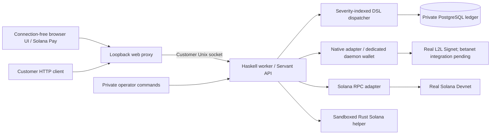

# ECX Solana Bridge

An inventory-backed bridge between native ECX-family networks and a wrapped Solana SPL token. Built for an operator to run a small, inspectable service with automatic deposits, payouts and durable accounting.

**Current milestone: a working local public-test bridge using real L2L Signet and Solana Devnet.** Both conversion directions have completed through the customer HTTP API and running worker, and a clean restart preserved the ledger and completed orders. This is a development implementation: browser-wallet acceptance, complete recovery, actual ECX betanet deployment and independent security review remain unfinished. Canonical intake is disabled.

The project follows the later requirements in the original ECX discussion: an operator-run wrapping/redemption service, **1% to wrap and 1% to redeem for new orders**, and separate Solana liquidity that can eventually be traded through Jupiter. The bridge is the conversion service; a DEX pool supplies market trading and price discovery. There is no custom blockchain, Solana token program or AMM implementation here.

## Current integrated revision

The [integrated implementation plan](docs/IMPLEMENTATION-PLAN.md) targets a connection-free interface, 1% fees in both directions, PostgreSQL/Opaleye throughout the database layer, and Servant handlers that produce a severity-indexed DSL for separate safe and critical evaluation. The local PostgreSQL paying runtime and both new 1% customer flows are working. Historical orders keep their original terms. The revised installer and remaining recovery workflows are being completed; deep auditing follows integrated acceptance.

## What the bridge does

The operator holds inventory on both chains. A confirmed native deposit authorizes a payout from wrapped-token inventory; a finalized wrapped-token deposit authorizes a native payout. Runtime conversion does not mint or burn tokens. Mint authority, official backing operations and liquidity-provider capital belong to separate operator workflows.

| Direction | Customer sends | Bridge pays | Bridge fee |
| --- | --- | --- | --- |
| Native → wrapped | Native coins to an order-specific address | Wrapped SPL tokens to the bound Solana wallet | 100 basis points |
| Wrapped → native | Wrapped SPL tokens through an order-bound Solana Pay request | Native coins to the bound native address | 100 basis points |

Both assets use eight decimal places. All API amounts are decimal strings in integer base units. For input `g`, the fee is `ceil(g × basisPoints / 10000)` and the payout is `g − fee`. Network fees and permitted recipient ATA rent are separately reserved operator costs; they do not silently change the quoted net amount. Orders preserve their original amount, destinations, fee policy and deadlines.

The bridge needs funded inventory and operating budgets on both sides. Low inventory blocks new quotes rather than creating an unbacked payout promise. Unknown, partial, extra or late deposits require explicit classification or recovery; sending arbitrary tokens to custody does not create an order.

## Architecture

One Haskell application provides the financial engine and typed Servant API, with two real-chain adapters, one PostgreSQL ledger accessed with Opaleye and a thin browser interface. The same executable runs as a private worker or a public web proxy. A small Rust helper handles a fixed Solana transaction format using official SDK/SPL interface crates.



### Process and key boundaries

| Component | Responsibility and access |
| --- | --- |
| `ecx-bridge postgres-api` | Exclusively owns the ledger; scans and reconciles while intake is paused. Serves separate customer and administrator Unix sockets. |
| `ecx-bridge postgres-test-worker` | Uses the same engine and explicitly enables automatic intake/payouts only for the real L2L Signet / Solana Devnet public-test profile with backups not required. It is not a canonical deployment mode. |
| `ecx-bridge serve` | Serves static assets and proxies only the typed customer API. Binds to loopback and receives no signer or database path. Administrator routes are excluded. |
| Native daemon wallet | Generates deposit addresses, funds/signs PSBTs and provides native chain/wallet evidence. RPC stays private and uses a cookie. |
| `ecx-solana-helper` | Constructs or signs only supported transactions under fixed mint/custody configuration. It has no RPC client. Unsigned previews do not read the signer. |
| Browser | Displays quotes/deposits/status and opens standard payment requests in the customer wallet. No frontend framework or Node server runs in production. |

Ubuntu services separate the worker, web and native-node users. Private file permissions protect the ledger, configuration, keys and RPC cookie. The helper runs through a restricted filesystem/network namespace with a scoped AppArmor policy. These boundaries have ARM64 installation evidence; they do not make a hot wallet immune to host compromise. The bridge runtime must not hold the mint-authority key or LP/backing keys.

### Durable financial workflow

1. **Admit and reserve.** Verify real chain identities, destinations, inventory, customer balances where relevant, fees/rent and operating limits. Save immutable quote terms and reservations.
2. **Bind the deposit.** Save a native address allocation claim before exposing the address, or bind a Solana Pay reference and derive refund ownership from verified payment evidence. Repeated requests retain the same order and instructions.
3. **Observe and verify.** Scan native wallet history and separate finalized Solana token/SOL histories. Save evidence and cursors atomically, then require the order's confirmation/finality policy.
4. **Prepare and sign.** Reserve operating costs and persist the exact preparation request/draft before signing. Validate the resulting transaction independently and save its exact signed bytes.
5. **Authorize and send.** Recheck the source, journal broadcast intent and enforce required backup coverage. Retries use the saved bytes. An uncertain send response is not permission to construct a second payment.
6. **Settle and reconcile.** Verify the actual chain outcome, book principal/fees/rent once and compare recorded custody with observed chain balances. Ambiguous evidence retains obligations and forces review.

The ledger uses balanced, append-only postings separately for native coins, wrapped tokens and operating SOL. Customer `principal`, unclassified receipts, payout `float`, earned fees, operating budgets, backing and LP allocations remain distinct. Wallet balance alone is not proof that money is available to quote. There is no arbitrary runtime credit operation.

Exclusive worker ownership, immutable attempts, generation fencing, input-lock recovery, rolling cost caps and revision-bound custody checks reduce replay and concurrency risk. Some loss/replacement/restore workflows remain partial; the application pauses instead of treating uncertain evidence as success or erasing customer claims.

## Source map

| Location | What to review |
| --- | --- |
| `src/Bridge/Types.hs`, `Config.hs`, `Budget.hs` | Amounts, deployment identity, immutable limits and operating budgets |
| `Ledger.hs`, `migrations/` | Financial journal, orders, reservations, attempts, recovery decisions and schema preservation |
| `Order.hs`, `Admission.hs`, `Deposit.hs` | Quote checks, recoverable deposit provisioning and customer deposit validation |
| `Native.hs`, `Solana.hs`, `Observer.hs` | Real-chain RPC adapters, identity checks, bounded history scans and evidence |
| `NativePayment.hs`, `SolanaPayment.hs`, `Payment.hs`, `Settlement.hs` | Transaction validation, preparation/signing, saved-byte send and verified settlement |
| `Reconciliation.hs`, `Recovery.hs`, `Reorg.hs`, `NativeReplacement.hs`, `Backup.hs` | Custody checks, pause/recovery, source/finality loss, replacement families and backup barriers |
| `API.hs`, `Web.hs`, `Worker.hs`, `app/Main.hs` | Shared Servant contract, customer proxy, worker and CLI entry points |
| `solana-helper/` | Fixed official-SDK helper and separate real-Devnet setup/test clients |
| `web/` | HTML/CSS/TypeScript interface and Solana Pay QR/payment links |
| `deploy/`, `scripts/install`, `scripts/build-release` | Pinned Linux build, packaged runtime, installer, systemd services and helper sandbox |
| `test/`, `docs/evidence/` | Regression contracts and recorded real-network/host acceptance |

## Build and installation

The tested dependency boundary is GHC **9.14.1**, Cabal **3.16.1.0**, Rust **1.97.1**, SQLite **3.53.4**, Node **25.4.0** and Bitcoin Core **30.2**. Cabal, Cargo and npm dependency graphs are locked. Linux upstream toolchain URLs/checksums are in [`deploy/toolchains.json`](deploy/toolchains.json). The legacy importer retains SQLite compatibility; the active PostgreSQL worker uses libpq/PostgreSQL 16.

On Ubuntu 24.04, from a reviewed checkout, run as a normal sudo-enabled user:

```sh
./scripts/install --with-signet --config-dir /absolute/private/setup
```

This installs prerequisites, builds/tests the application and installs the runtime plus a dedicated real L2L Signet node. The setup directory supplies `worker.json`, `helper.json` and a custody `signer.json` only when signing is intended. Configuration, wallet identities and funding cannot be invented by an installer. Without `--config-dir`, software/node installation proceeds but bridge services wait for configuration.

The build also produces a self-contained architecture-specific installer:

```sh
sha256sum -c ecx-bridge-ubuntu-24.04-aarch64.run.sha256
sh ecx-bridge-ubuntu-24.04-aarch64.run --with-signet --config-dir /absolute/private/setup
```

Target hosts need no compiler or Node installation. Default worker mode observes with intake paused; `--test-worker` explicitly enables the funded public-test mode. Use the package matching the server CPU. **The PostgreSQL ARM64 package passed installation, repeat installation, reboot, private-role checks and same-host backup restoration. x86-64 PostgreSQL acceptance remains pending.** The locally built installers are checksummed, not signed published releases; no public download endpoint exists yet.

Repeated installation of the same release/configuration preserves services and the ledger. Different releases/configuration are refused rather than silently upgrading a funded deployment. The web endpoint binds to `127.0.0.1:8080`; remote access uses an SSH tunnel unless a separately configured TLS proxy is provided. No public firewall port or native RPC endpoint is opened.

See [`docs/INSTALL.md`](docs/INSTALL.md) for exact paths, users, configuration and operating commands. The new ARM64 build includes dependency notices collected against its actual graph and verifies saved native-notice hashes before packaging. License applicability and dependency security review remain release gates.

For an already configured local public-test environment:

```sh
PGHOST=/private/socket PGPORT=29436 PGDATABASE=ecx_bridge PGUSER=YOUR_DB_ROLE \
  ./scripts/start-local /absolute/private/config.json --postgres --binary /absolute/path/to/ecx-bridge
```

The local launcher serves `http://127.0.0.1:61734` and accepts only the public-test profile. For source checks with the pinned tools and matching SQLite available:

```sh
./scripts/check
```

## What is verified

| Checkpoint | Evidence and limits |
| --- | --- |
| Financial/state contracts | 368 Haskell examples plus 100 generated arithmetic cases; [`test output`](docs/evidence/haskell-tests.txt). These tests do not substitute for real-chain acceptance. |
| Helper and installer contracts | Seven Rust tests and nine installer tests pass in the revised ARM64 build. The new installer regression checks that helper imports preserve the package inventory. |
| Browser source | Strict TypeScript checking and asset build pass. A connection-free quote, invalid-amount rejection, QR instructions and saved-order reload were verified in the browser. Actual supported-wallet Solana Pay signing remains pending. [`Evidence`](docs/evidence/postgres-product-flows.json). |
| Operator setup | Interactive private configuration, hidden-input TTY check, actual custody-key identity validation and real Devnet identity configuration pass locally. Compiled Ubuntu ARM64 wizard, custom port, private configuration and same-release repeat installation pass. Cross-release upgrades and x86-64 acceptance remain. |
| PostgreSQL product | Both new 1% conversions paid; verified-owner full refund, explicit expired retry, unsigned cancellation and clean restart passed on real Signet/Devnet. [`Evidence`](docs/evidence/postgres-product-flows.json). |
| Automatic real-chain round trips | Both customer-API orders paid by the running test worker; custody matched. Deposits used dedicated native/official-SDK tester clients, not browser extensions. [`Transfer/restart evidence`](docs/evidence/local-product-transfers.json). |
| Restart preservation | Financial rows and completed authenticated order views survived a clean launcher restart. Same evidence above. |
| Real refund and expired Solana attempt | Full late-deposit refund and a retained expired attempt followed by one proven replacement; [`evidence`](docs/evidence/late-ledger-refund.json). Canonical independent-provider acceptance remains separate. |
| Native paused recovery and locks | Existing payment reconciliation and daemon input-lock restoration were exercised; [`worker recovery`](docs/evidence/paused-worker-recovery.json), [`lock recovery`](docs/evidence/native-lock-recovery.json). |
| Ubuntu ARM64 installation | Clean runtime VM, separate users, helper sandbox, integrity refusal, repeat installation, real-chain doctor and VM reboot; [`installer evidence`](docs/evidence/linux-installer.json). This is not full host/key restore. |
| PostgreSQL ARM64 installation | Observation-mode installation with a fresh ledger, repeat installation, automatic service restart after reboot, restricted database roles, and all 38 tables restored with matching rows. [`Evidence`](docs/evidence/postgres-installer-arm64.json). This is a same-host restore, not remote host/key recovery. |

The current public-test mint is independently created Devnet test inventory, **not the canonical wbECX mint discussed by the ECX team**. No official affiliation, canonical reserve backing, valuable-fund pilot, liquidity pool, Jupiter route or mainnet launch is claimed by these tests.

## Remaining challenges and delivery sequence

The [current implementation plan](docs/IMPLEMENTATION-PLAN.md) orders delivery as
complete runtime/customer flows, one-command installation, then bounded audits.
The following inventory retains the broader release scope. These are not equal-sized percentages; [`docs/STATUS.md`](docs/STATUS.md) is the detailed evidence/backlog record.

| Order | Remaining work | Why it matters |
| --- | --- | --- |
| 1. Finish the usable test product | Actual supported-wallet signing, saved-order browser reload and interface acceptance. Browser automation currently cannot verify its administrator policy. | API round trips alone do not prove the customer wallet flow works. |
| 2. Finish installer acceptance | Complete Ubuntu x86-64 build/install/reboot checks, verify notice-bearing packages and prepare authenticated release distribution. | A source build or ARM64 result does not prove an Intel/AMD server installation. |
| 3. Complete payment/reorg recovery | Integrated private native replacement send with a real Signet family; covered-source resolution, missing-destination treatment and finalized Solana history-loss handling. | Ambiguous or changed chain evidence must preserve customer claims and prevent duplicate payout. |
| 4. Complete backup, restore and resume | Remote critical backups/retention, old-ledger/old-signer fencing, key restoration, exact-byte recovery, independent-provider expiry and clean-host acceptance. | Process restart is much narrower than losing a host and recovering a hot wallet. |
| 5. Exercise actual ECX betanet | Official daemon provenance/checkpoint, separate funded deployment, replay policy and real deposit/payout/refund. | Signet is real, but does not establish betanet compatibility. |
| 6. Freeze and review | Native/system-library notice applicability, Rust/Haskell advisory analysis, release provenance/signatures, installed-release review and independent security review. | Passing tests and having license texts are not a security audit or distribution certification. |
| 7. Authorized canonical pilot | Operator identities, mint policy, verified backing/supply, inventory, limits, independent RPC and explicitly allocated funding. | This establishes the actual token and reserve relationships; the test mint cannot stand in for them. |
| 8. Solana markets and pricing | Choose/fund a real wrapped-ECX/USDC liquidity venue, verify actual Jupiter routing/API access and provide historical pricing plus the intended eCash-site integration. | The bridge moves value at quoted conversion terms; market prices come from real liquidity. |
| 9. Future mainnet | Official network/launch identity and a separately reviewed activation. | No speculative activation or redemption promise is embedded in this build. |

Public RPC rate limits/history gaps, native confirmation/replacement semantics, Solana blockhash expiry, account rent, custody solvency and interrupted storage/backup operations are the main integration risks. Existing guards retain exact work and pause on uncertainty; the remaining acceptance checks must establish that every recovery path works together on the actual networks and hosts.

Jupiter was part of the intended market path, not a replacement for native wrapping/redemption. The later conversation preferred existing Solana services over building an exchange. Historical pool/range/price suggestions are not deployed parameters or current market recommendations. Capital contributions, canonical mint operations and launch/advertising remain separate authorized actions.

## Documentation and license

- [`docs/OPERATIONS.md`](docs/OPERATIONS.md): customer flow, restricted diagnostics, backup limitations, separate token and liquidity administration.
- [`docs/STATUS.md`](docs/STATUS.md): implemented behavior, real evidence and remaining gates.
- [`docs/CONTRACTS.md`](docs/CONTRACTS.md): accounting, amount, API and recovery contracts; historical checkpoints are explicitly distinguished from current public-test operation in STATUS.
- [`docs/LOCAL-DEVELOPMENT.md`](docs/LOCAL-DEVELOPMENT.md): local operation and dedicated public-test procedures.
- [`docs/THIRD-PARTY.md`](docs/THIRD-PARTY.md): notice provenance, 333-entry dependency collection and remaining review.

MIT license for this repository. Dependencies retain their respective licenses. This repository contains source and public-test evidence; custody keys, private runtime configuration, ledgers, backups and chain data belong outside Git.
